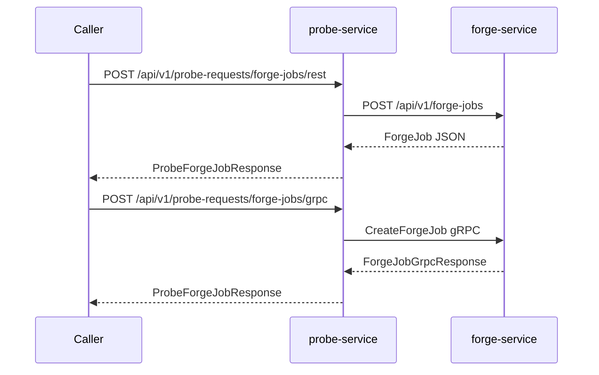

# Service boundary

## probe-service owns

- Public REST APIs under `/api/v1/probe-requests/`
- Public request/response DTOs (`CreateProbeForgeJobRequest`, `ProbeForgeJobResponse`)
- Orchestration in the service layer
- REST client behavior toward `forge-service`
- gRPC client behavior toward `forge-service`
- Deadline handling on gRPC calls
- Mapping remote errors to probe-service HTTP responses
- Transport selection (REST vs gRPC) per endpoint

## forge-service owns

- Provider REST and gRPC APIs
- Forge job state (in-memory)
- Domain validation on create/get
- Provider-side error messages and status codes

## Downstream REST DTOs

Classes under `dto/client/forge/` represent the forge-service REST contract only. They are not exposed as probe-service public API models.

## Flow

