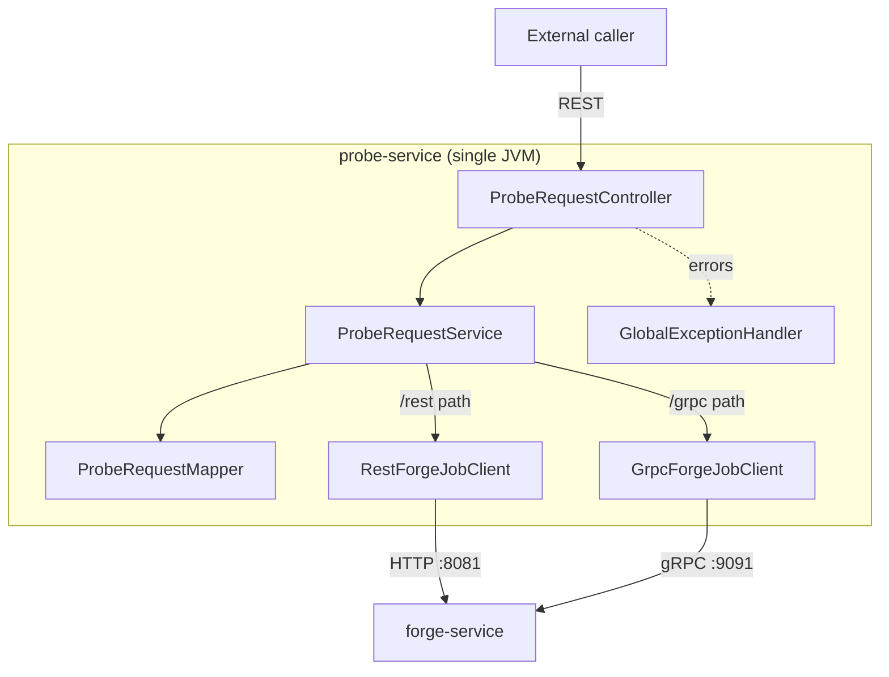

# Architecture

## System purpose

`probe-service` is the caller-side Spring Boot service in the Code Istari learning POC. It exposes its own public REST API and, on behalf of an external caller, delegates forge-job creation/retrieval to `forge-service` over either REST or gRPC — the caller picks the transport by hitting a different endpoint.

## Module/package map

| Package | Responsibility |
|---|---|
| `com.codeistari.probe` | Application bootstrap (`ProbeServiceApplication`) |
| `com.codeistari.probe.controller` | Public REST entrypoint (`ProbeRequestController`) |
| `com.codeistari.probe.service` | Orchestration (`ProbeRequestService`) |
| `com.codeistari.probe.client` | `ForgeJobClient` interface; `BaseApiClient` shared REST-call helper |
| `com.codeistari.probe.client.rest` | `RestForgeJobClient` + `RestForgeClientConfig` |
| `com.codeistari.probe.client.grpc` | `GrpcForgeJobClient` + `GrpcForgeClientConfig` |
| `com.codeistari.probe.mapper` | `ProbeRequestMapper` — public DTO ↔ downstream DTO/proto mapping |
| `com.codeistari.probe.config` | `ForgeClientProperties` (`forge.*` config), `ResilienceConfig` (Resilience4j predicates), `RestClientFactory` |
| `com.codeistari.probe.dto.request` / `.dto.response` | Public API DTOs (`CreateProbeForgeJobRequest`, `ProbeForgeJobResponse`) |
| `com.codeistari.probe.dto.client.forge.request` / `.response` | Downstream forge-service REST DTOs (`ForgeCreateJobRestRequest`, `ForgeJobRestResponse`) — deliberately kept separate from the public DTOs |
| `com.codeistari.probe.exception` | `ForgeRemoteCallException`, `ErrorResponse`, `GlobalExceptionHandler` |
| `com.codeistari.probe.domain` | `ArtifactType`, `ForgeMaterial` (mirrored from forge-service), `ForgeTransport` (`REST`/`GRPC`, probe-specific) |

## Request lifecycle

1. An external caller hits one of four `ProbeRequestController` endpoints, explicitly choosing REST or gRPC as the downstream transport via the URL path (`/rest` or `/grpc`).
2. `CreateProbeForgeJobRequest` is validated via Jakarta Bean Validation annotations (create endpoints only).
3. `ProbeRequestService` maps the public request into the downstream shape via `ProbeRequestMapper`, then calls either `RestForgeJobClient` or `GrpcForgeJobClient` directly (both are held as concrete-typed fields on the service, not dispatched through the shared `ForgeJobClient` interface — see `docs/AI_CONTEXT.md` known deviations).
4. The downstream client call is wrapped in a Resilience4j `@CircuitBreaker` + `@Retry` pair (`FORGE_REST` or `FORGE_GRPC`), with a bounded timeout (REST: `forge.rest.timeout-ms`, default 2000ms) or deadline (gRPC: `forge.grpc.deadline-ms`, default 2000ms).
5. On success, `ProbeRequestMapper` converts the forge-service response (`ForgeJobRestResponse` or gRPC `ForgeJobGrpcResponse`) into the public `ProbeForgeJobResponse`, tagging it with `transport: REST` or `GRPC`.
6. On failure, `GlobalExceptionHandler` maps: `MethodArgumentNotValidException` → 400; `ForgeRemoteCallException` → its carried status (mapped from forge-service's REST/gRPC error, see below); `CallNotPermittedException` (circuit open) → 503.

## Data flow

Both transports converge only at `ProbeRequestService` and `ProbeRequestMapper`; the client layer is fully duplicated per transport (`RestForgeJobClient` vs `GrpcForgeJobClient`), each independently wrapped in resilience policies. There is no shared retry/circuit-breaker instance between transports — `FORGE_REST` and `FORGE_GRPC` are configured separately in `application.yml` (currently with identical settings).

## Architectural principles

- **Latency**: every downstream call is time-bounded — REST via `JdkClientHttpRequestFactory` connect/read timeout, gRPC via `withDeadlineAfter`; both default to 2000ms and are configurable via `forge.rest.timeout-ms` / `forge.grpc.deadline-ms`.
- **Cache**: none.
- **Resilience**: Resilience4j `CircuitBreaker(Retry(call))` per transport. Only server-side/network failures are retried and counted toward the circuit breaker (`ResilienceConfig.isRetryableFailure`: HTTP 5xx/408, gRPC `DEADLINE_EXCEEDED`/`INTERNAL`/`UNAVAILABLE`/`RESOURCE_EXHAUSTED`/`ABORTED`, or network-level `ConnectException`/`HttpTimeoutException`/`IOException`); client errors (4xx, `INVALID_ARGUMENT`, `NOT_FOUND`) fail fast without retry.
- **Transactions**: none — probe-service is stateless; it holds no data of its own (see `docs/entities-enums.md`).
- **Compatibility**: `dto/client/forge/*` mirrors forge-service's REST contract and the generated proto types mirror its gRPC contract; both must be updated together with forge-service per `docs/external-services.md`.

## Deployment/runtime

Single Spring Boot process (Java 25 toolchain, Spring Boot 4.0.6) serving REST only, on port 8082. There is no server-side gRPC in this service — the embedded gRPC usage is entirely as a client (`ManagedChannel` to `forge-service`). Requires `forge-service` reachable at the configured REST base URL / gRPC host:port (defaults: `http://localhost:8081`, `localhost:9091`).

## Component diagram

