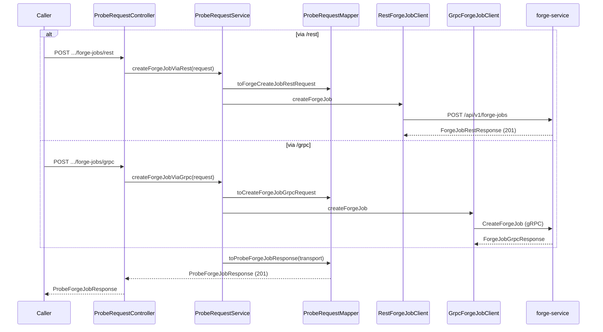
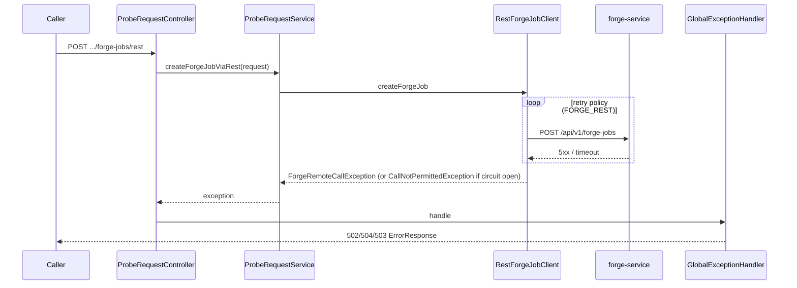

# Create Forge Job (via probe-service)

## Purpose

Accept a public create request and delegate it to `forge-service`, via the caller-selected transport (REST or gRPC), applying resilience (timeout/deadline + circuit breaker + retry) around the downstream call.

## Entrypoints

| Endpoint | Downstream transport | Source |
|---|---|---|
| `POST /api/v1/probe-requests/forge-jobs/rest` | forge-service REST | `controller/ProbeRequestController.java#createViaRest` |
| `POST /api/v1/probe-requests/forge-jobs/grpc` | forge-service gRPC | `controller/ProbeRequestController.java#createViaGrpc` |

## Request / response contract

Request: `CreateProbeForgeJobRequest` (`artifactName`, `artifactType`, `material`, `requestedBy`, `powerLevel` — same validation rules as forge-service, see `specs/001-artifact-forging-rest-grpc/spec.md`). Response: `ProbeForgeJobResponse`, identical fields plus `transport: "REST"` or `"GRPC"`.

## Steps

1. Caller sends a REST JSON body to `/rest` or `/grpc`.
2. `ProbeRequestController` validates the request via Jakarta Bean Validation annotations on `CreateProbeForgeJobRequest`.
3. `ProbeRequestService.createForgeJobViaRest`/`createForgeJobViaGrpc` uses `ProbeRequestMapper` to build the downstream request (`ForgeCreateJobRestRequest` or `CreateForgeJobGrpcRequest`).
4. The downstream client call runs inside Resilience4j `@CircuitBreaker`/`@Retry` (`FORGE_REST` or `FORGE_GRPC`): `RestForgeJobClient.createForgeJob` (bounded by `forge.rest.timeout-ms`) or `GrpcForgeJobClient.createForgeJob` (bounded by `forge.grpc.deadline-ms`).
5. On success, `ProbeRequestMapper.toProbeForgeJobResponse` converts the forge-service response into `ProbeForgeJobResponse`, tagging `transport`.
6. On failure, the client maps the error to a `ForgeRemoteCallException` with an appropriate HTTP status (see edge cases), which `GlobalExceptionHandler` renders to the caller.

## Key source files

| File | Role |
|---|---|
| `controller/ProbeRequestController.java` | Public entrypoints |
| `service/ProbeRequestService.java` | Orchestration |
| `mapper/ProbeRequestMapper.java` | Public ↔ downstream mapping |
| `client/rest/RestForgeJobClient.java`, `client/BaseApiClient.java` | REST downstream call + error mapping |
| `client/grpc/GrpcForgeJobClient.java` | gRPC downstream call + error mapping |
| `config/ResilienceConfig.java` | Retry/circuit-breaker predicates |

## Edge cases

- Invalid public request body → 400 (`MethodArgumentNotValidException`), no downstream call made.
- forge-service returns 4xx (REST) / `INVALID_ARGUMENT` or `NOT_FOUND` (gRPC) → passed through as the same status, **not retried**.
- forge-service returns 5xx / network failure (REST) or `DEADLINE_EXCEEDED`/`INTERNAL`/`UNAVAILABLE`/`RESOURCE_EXHAUSTED`/`ABORTED` (gRPC) → retried per `FORGE_REST`/`FORGE_GRPC` policy (3 attempts, exponential backoff), then surfaced as 502/504.
- Circuit breaker open (after repeated downstream failures) → 503 via `CallNotPermittedException`, without attempting the call.

## Sequence diagrams

### Happy path

### Downstream failure (retry exhausted / circuit open)

