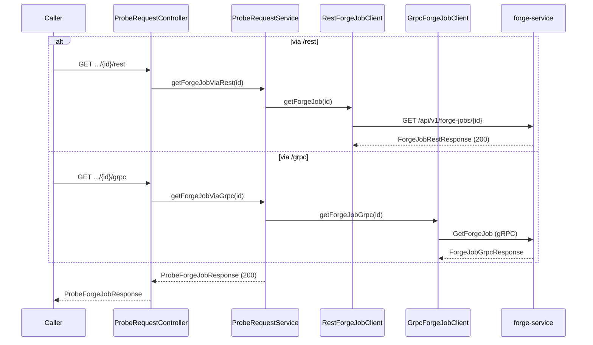
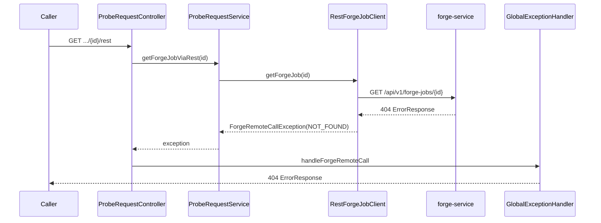

# Get Forge Job (via probe-service)

## Purpose

Retrieve an existing forge job from `forge-service` by `forgeJobId`, via the caller-selected transport (REST or gRPC).

## Entrypoints

| Endpoint | Downstream transport | Source |
|---|---|---|
| `GET /api/v1/probe-requests/forge-jobs/{forgeJobId}/rest` | forge-service REST | `controller/ProbeRequestController.java#getViaRest` |
| `GET /api/v1/probe-requests/forge-jobs/{forgeJobId}/grpc` | forge-service gRPC | `controller/ProbeRequestController.java#getViaGrpc` |

## Request / response contract

Request carries only `forgeJobId` (path variable). Response is `ProbeForgeJobResponse` (same shape as create's response) tagged with `transport`, or an error status when forge-service reports not-found or a downstream failure.

## Steps

1. Caller requests by `forgeJobId` on `/rest` or `/grpc`.
2. `ProbeRequestController.getViaRest`/`getViaGrpc` calls `ProbeRequestService.getForgeJobViaRest`/`getForgeJobViaGrpc`.
3. The service calls `RestForgeJobClient.getForgeJob` or `GrpcForgeJobClient.getForgeJobGrpc`, each wrapped in its Resilience4j circuit-breaker/retry pair.
4. On success, `ProbeRequestMapper.toProbeForgeJobResponse` converts the forge-service response to `ProbeForgeJobResponse`.
5. On not-found: REST client receives forge-service's 404 and `BaseApiClient.handleResponse` raises `ForgeRemoteCallException(NOT_FOUND, ...)`; gRPC client catches `StatusRuntimeException` with code `NOT_FOUND` and raises the same exception type via `mapGrpcException`. Neither path retries a not-found result (4xx-equivalent, fails fast).
6. `GlobalExceptionHandler` renders the exception's carried HTTP status to the caller.

## Key source files

| File | Role |
|---|---|
| `controller/ProbeRequestController.java` | Public entrypoints |
| `service/ProbeRequestService.java` | Orchestration |
| `client/rest/RestForgeJobClient.java`, `client/BaseApiClient.java` | REST downstream call + 404 mapping |
| `client/grpc/GrpcForgeJobClient.java` | gRPC downstream call + `NOT_FOUND` mapping |
| `exception/GlobalExceptionHandler.java` | Final error → HTTP response mapping |

## Edge cases

- Unknown `forgeJobId` → forge-service 404/`NOT_FOUND` → probe-service 404, fails fast (no retry).
- forge-service unreachable / times out → 502/504 after the retry policy is exhausted.
- Circuit breaker open → 503 (`CallNotPermittedException`), call not attempted.

## Sequence diagrams

### Happy path

### Not-found path

