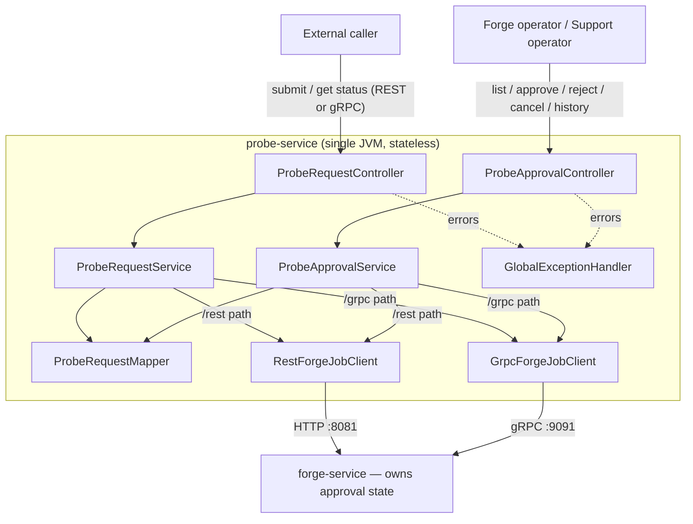

## Context

`probe-service` is the caller-facing Spring Boot service in this POC. It is
fully stateless today: it holds no entities, no database, no cache, and no
in-memory store (`docs/entities-enums.md`). Every public REST call is mapped
1:1 to a downstream call on `forge-service` — either REST (`RestForgeJobClient`)
or gRPC (`GrpcForgeJobClient`), both implementing the shared `ForgeJobClient`
interface, both wrapped in Resilience4j `CircuitBreaker(Retry(...))` pairs
(`FORGE_REST` / `FORGE_GRPC`), both time-bounded (2000ms default). Only
`createForgeJob` and `getForgeJob` exist today, on both transports
(`docs/architecture.md`).

The approved Functional Spec (`product-specs/POC-HIGH-POWER-APPROVAL.md`,
including its Clarifications section) requires an approval lifecycle
(`PENDING_APPROVAL → APPROVED/REJECTED/EXPIRED/CANCELLED`) that gates forging
for power level 8–10 requests, plus operator review, expiry, requester
cancellation, retry/resubmission, and decision-history operations — while
leaving service ownership, APIs, storage, and implementation approach
unresolved until Technical Design (per the OpenSpec proposal and all six
capability specs under `specs/`).

**Parallel SDD context (PD-001, `parallel-design-review.md`):** Gate 1
discovery found a functionally-consistent counterpart Technical Spec PR in
`forge-service` (`https://github.com/Jenish16/forge-service/pull/3`) for this
same initiative, also deferring ownership. The developer classified this as a
`dependency`, not a simple pass: this design must not silently assume any
cross-service resolution that forge-service's own (not-yet-written)
Technical Design could contradict. Every such assumption below is called out
explicitly as a **cross-service dependency** rather than treated as settled.

**Developer-confirmed decisions for this design session:**

1. **Ownership** — `forge-service` owns the approval workflow and its state
   (submission dedupe, lifecycle, operator review, expiry, decision history).
   `probe-service` is a thin orchestration/facade: it exposes the required
   user operations on its own public API and delegates to `forge-service`.
   `forge-service`'s own existing create/get contract is not changed by this
   repository; new approval-aware behavior is expected to arrive as
   additions to the forge-service contract (see Cross-service dependencies).
2. **Operator identity** — probe's public API accepts a plain `operatorId`
   field, unauthenticated, same trust level as the existing `requestedBy`
   field (no role provisioning per Functional Spec's Out of scope).
3. **Transport scope** — every new operation (list pending, approve, reject,
   cancel, decision history) gets both a REST and a gRPC variant, mirroring
   the existing `createForgeJob`/`getForgeJob` dual-transport pattern.
4. **Requester reference** — a new explicit `requesterReference` field is
   added to the public submission DTO, distinct from `requestedBy`, used as
   the idempotency/retry key.
5. **Retry linkage** — an optional `originalRequestReference` field on
   submission lets a requester start a new attempt with a new
   `requesterReference` while explicitly linking it to a prior request's
   decision history.

## Goals / Non-Goals

**Goals:**
- Expose all seven required user operations (submit, retrieve state, list
  pending, approve, reject, cancel, retrieve history) on probe-service's
  public REST and gRPC-facing API, preserving today's dual-transport pattern.
- Preserve probe-service's existing stateless, thin-orchestration
  architecture — no new persistence, cache, or scheduler is added to this
  repository.
- Reuse existing patterns exactly: `BaseApiClient`, `ForgeRemoteCallException`
  + `GlobalExceptionHandler`, `ResilienceConfig` circuit-breaker/retry
  predicates, `ProbeRequestMapper`-style per-transport mapping, DTO boundary
  separation (`dto/request`/`dto/response` vs `dto/client/forge/*`).
- Implement every functional requirement and all nine Clarifications
  normatively, without duplicating forge-service's business logic beyond
  caller-side request shaping.
- Make every cross-service assumption explicit and traceable to a PD
  decision or an open dependency, per PD-001.

**Non-Goals:**
- Deciding or implementing forge-service's internal approval state machine,
  storage, or expiry mechanism — that is forge-service's Technical Design.
- Real authentication/authorization for operators or requesters (explicitly
  out of scope in the Functional Spec).
- Notifications/reminders, material inventory checks, pricing/quota
  enforcement (explicitly out of scope).
- Any new persistent storage in probe-service (explicitly out of scope; the
  Functional Spec also treats persistent storage as unspecified).
- Finalizing forge-service's wire contract field names — this design states
  probe-service's expected/required shape of that contract as a dependency,
  not a mandate.

## Architecture



probe-service adds **no new state of its own**. Every operation — including
"list pending" and "decision history" — is a live proxy call to
forge-service; there is no local caching, consistent with the existing
architectural principle ("Cache: none").

## Components

| Component | Change |
|---|---|
| `controller.ProbeRequestController` | Extended: `create*`/`get*` responses now carry approval fields (see Data model). No new endpoints here. |
| `controller.ProbeApprovalController` (new) | New REST endpoints for list-pending, approve, reject, cancel, decision-history. |
| `service.ProbeRequestService` | Extended: submission/get flows pass through `requesterReference`/`originalRequestReference` and surface approval fields. |
| `service.ProbeApprovalService` (new) | Orchestrates the five new operator/audit operations across REST and gRPC transports, mirroring `ProbeRequestService`'s per-transport method pairs. |
| `client.ApprovalForgeClient` (new interface) | `listPendingApprovals()`, `approveRequest(...)`, `rejectRequest(...)`, `cancelRequest(...)`, `getDecisionHistory(...)` — kept separate from `ForgeJobClient` rather than added to it (see Alternatives). |
| `client.rest.RestApprovalForgeClient` (new) | REST implementation of `ApprovalForgeClient`, extends `BaseApiClient`, same `FORGE_REST` circuit-breaker/retry names. |
| `client.grpc.GrpcApprovalForgeClient` (new) | gRPC implementation, same `FORGE_GRPC` circuit-breaker/retry names, same deadline property. |
| `mapper.ProbeRequestMapper` | Extended with mapping methods for the new DTOs (REST and gRPC directions), following the existing per-transport overload pattern. |
| `dto.request` / `dto.response` | New request/response records (see Data model). Existing `CreateProbeForgeJobRequest`/`ProbeForgeJobResponse` extended additively. |
| `dto.client.forge.request` / `.response` | New downstream DTOs mirroring the *expected* forge-service approval contract (flagged as a cross-service dependency). |
| `domain.ApprovalStatus` (new enum) | `PENDING_APPROVAL`, `APPROVED`, `REJECTED`, `EXPIRED`, `CANCELLED` — probe-side mirror of forge-service's lifecycle, same duplication pattern already used for `ArtifactType`/`ForgeMaterial`. |
| `exception.*`, `config.ResilienceConfig`, `client.BaseApiClient` | Unchanged — reused as-is for all new calls. |

## State and data models

probe-service persists nothing (unchanged principle). The models below are
transient DTOs and one new enum, matching the existing pattern in
`docs/entities-enums.md`.

**`domain.ApprovalStatus`** (new enum, mirrors forge-service's lifecycle):
`PENDING_APPROVAL`, `APPROVED`, `REJECTED`, `EXPIRED`, `CANCELLED`.

**`CreateProbeForgeJobRequest`** (extended):
```java
public record CreateProbeForgeJobRequest(
    @NotBlank String artifactName,
    @NotNull ArtifactType artifactType,
    @NotNull ForgeMaterial material,
    @NotBlank String requestedBy,
    @Min(1) @Max(10) int powerLevel,
    @NotBlank String requesterReference,        // NEW — idempotency/retry key
    String originalRequestReference) {}          // NEW — optional, links a new
                                                  // reference to a prior request's
                                                  // history (Decision 5)
```

**`ProbeForgeJobResponse`** (extended):
```java
public record ProbeForgeJobResponse(
    String forgeJobId,
    String artifactName,
    ArtifactType artifactType,
    ForgeMaterial material,
    String requestedBy,
    int powerLevel,
    String status,                    // unchanged: forge-service processing
                                       // status, null/absent while
                                       // PENDING_APPROVAL
    Instant createdAt,
    ForgeTransport transport,
    String requesterReference,        // NEW — echoes the idempotency key
    String originalRequestReference,  // NEW — nullable, echoes the link if any
    ApprovalStatus approvalStatus,    // NEW — null/absent for power level 1–7
    String rejectionReason,           // NEW — populated only when REJECTED
    Instant approvalExpiresAt) {}     // NEW — populated only while
                                       // PENDING_APPROVAL (and retained on
                                       // EXPIRED per spec)
```

`forgeJobId` remains the single stable identifier returned immediately on
submission (Functional Spec requirement 4), for both approval-gated and
ordinary requests — see Cross-service dependency D-1 below for the
assumption this relies on.

**New: `ProbePendingApprovalSummary`** (list-pending entry):
```java
public record ProbePendingApprovalSummary(
    String forgeJobId,
    String requesterReference,
    String requestedBy,
    ArtifactType artifactType,
    ForgeMaterial material,
    int powerLevel,
    Instant submittedAt,
    Instant approvalExpiresAt) {}
```

**New: `ApprovalDecisionRequest`** (approve/reject body):
```java
public record ApprovalDecisionRequest(
    @NotBlank String operatorId,
    String reason) {}   // required by validation only on the reject endpoint
```

**New: `CancelRequestRequest`** (cancel body — kept minimal; requester
identity is not re-verified per Functional Spec's deferred authz):
```java
public record CancelRequestRequest(@NotBlank String requestedBy) {}
```

**New: `DecisionHistoryEntry`** / **`DecisionHistoryResponse`**:
```java
public record DecisionHistoryEntry(
    String forgeJobId,          // which attempt this decision belongs to
    String operatorId,
    ApprovalStatus decision,    // APPROVED or REJECTED
    String reason,
    Instant decidedAt) {}

public record DecisionHistoryResponse(
    String requesterReference,
    List<DecisionHistoryEntry> decisions) {}
```

## Interfaces

### Public REST API (existing base path `/api/v1/probe-requests/forge-jobs`)

| Method | Path | Change |
|---|---|---|
| `POST` | `/rest` | Existing. Request/response extended per Data model. Power 8–10 now returns `approvalStatus: PENDING_APPROVAL`; no forging begins. |
| `POST` | `/grpc` | Existing. Same extension via the gRPC downstream path. |
| `GET` | `/{forgeJobId}/rest` | Existing. Response now carries combined approval + processing status. |
| `GET` | `/{forgeJobId}/grpc` | Existing. Same extension via gRPC. |
| `GET` | `/pending/rest` (new) | List pending approvals, oldest-first, via REST downstream. |
| `GET` | `/pending/grpc` (new) | Same, via gRPC downstream. |
| `POST` | `/{forgeJobId}/approve/rest` (new) | Approve, body `ApprovalDecisionRequest` (reason ignored). |
| `POST` | `/{forgeJobId}/approve/grpc` (new) | Same, via gRPC. |
| `POST` | `/{forgeJobId}/reject/rest` (new) | Reject, body `ApprovalDecisionRequest` (`reason` required — `@NotBlank`). |
| `POST` | `/{forgeJobId}/reject/grpc` (new) | Same, via gRPC. |
| `POST` | `/{forgeJobId}/cancel/rest` (new) | Cancel, body `CancelRequestRequest`. |
| `POST` | `/{forgeJobId}/cancel/grpc` (new) | Same, via gRPC. |
| `GET` | `/history/{requesterReference}/rest` (new) | Decision history across all linked attempts. |
| `GET` | `/history/{requesterReference}/grpc` (new) | Same, via gRPC. |

Path identifiers use `forgeJobId` (the stable reference from submission) for
per-attempt operations and `requesterReference` for history, since history
spans multiple `forgeJobId`s that share a reference or link
(`originalRequestReference`).

### Downstream client interface (new): `client.ApprovalForgeClient`

```java
public interface ApprovalForgeClient {
  List<ForgePendingApprovalRestResponse> listPendingApprovals();
  ForgeJobRestResponse approveRequest(String forgeJobId, String operatorId);
  ForgeJobRestResponse rejectRequest(String forgeJobId, String operatorId, String reason);
  ForgeJobRestResponse cancelRequest(String forgeJobId, String requestedBy);
  ForgeDecisionHistoryRestResponse getDecisionHistory(String requesterReference);
}
```

Implemented by `RestApprovalForgeClient` (extends `BaseApiClient`, same
`FORGE_REST` circuit breaker/retry names) and `GrpcApprovalForgeClient` (same
`FORGE_GRPC` names, same deadline property, same `mapGrpcException` status
mapping as `GrpcForgeJobClient`). `ForgeCreateJobRestRequest` and
`ForgeJobRestResponse` gain the same additive fields as their public
counterparts (`requesterReference`, `originalRequestReference`,
`approvalStatus`, `rejectionReason`, `approvalExpiresAt`).

### Cross-service dependencies (not decided by this design)

These are the exact points where probe-service's contract depends on
forge-service's not-yet-written Technical Design, per PD-001. They are
documented as **required capabilities from forge-service**, not as settled
field names:

- **D-1 (stable reference before forging)**: forge-service must return a
  stable identifier immediately on submission, even for `PENDING_APPROVAL`
  requests where no forging has started. This design assumes it can keep
  reusing `forgeJobId` as that identifier; if forge-service's design instead
  introduces a separate pre-forging identifier, probe's public contract and
  this design's field mapping must be revisited.
- **D-2 (approval-aware create/get)**: forge-service's existing
  `createForgeJob`/`getForgeJob` REST and gRPC contracts must additively
  carry `approvalStatus`, `rejectionReason`, `approvalExpiresAt`,
  `requesterReference`, `originalRequestReference` — this design assumes
  additive fields on the existing contract rather than new dedicated
  submit-for-approval endpoints.
- **D-3 (new approval operations)**: forge-service must expose equivalent
  REST and gRPC operations for list-pending, approve, reject, cancel, and
  decision-history — none of these exist in `forge-service`'s contract
  today (`docs/external-services.md`). Exact paths/RPC names are
  forge-service's choice; probe's new client interface above is this
  repository's expected shape, subject to change once forge-service's
  design is published.
- **D-4 (gRPC proto additions)**: per project rules, this repository does
  not change forge-service's proto contract
  (`proto/artifact_forge_service.proto` is a mirror, not the source of
  truth). New RPCs for D-3 must be added to forge-service's proto first and
  mirrored here once agreed.
- **D-5 (operator identity passthrough)**: `operatorId` is passed to
  forge-service unauthenticated; forge-service's decision-history recording
  must accept and store it as an opaque string (Decision 2).

## Error handling

Reuses the existing `ForgeRemoteCallException` + `GlobalExceptionHandler`
pattern for every new call — no new exception types.

| Condition | HTTP status | Mechanism |
|---|---|---|
| Reject without a reason | `400 Bad Request` | Bean Validation (`@NotBlank` on `ApprovalDecisionRequest.reason`, enforced only on the reject endpoint via a validation group or a dedicated `RejectRequest` subtype if Bean Validation groups prove awkward) |
| Conflicting resubmission (same reference, different content, still open) | `409 Conflict` | forge-service returns 409/`ALREADY_EXISTS`-equivalent; mapped via existing `handleResponse`/`mapGrpcException` |
| Competing decision after terminal state | `409 Conflict` | Same mapping path |
| Decision after expiry | `409 Conflict` | Same mapping path |
| Approve/reject/cancel on unknown `forgeJobId` | `404 Not Found` | Existing `NOT_FOUND` gRPC mapping / REST 404 passthrough |
| Idempotent duplicate / safe repeat | `200 OK` (not an error) | forge-service returns the existing/unchanged resource; probe returns it as-is |
| Downstream circuit open | `503 Service Unavailable` | Existing `CallNotPermittedException` handler, unchanged |
| Downstream timeout | `504 Gateway Timeout` | Existing REST/gRPC timeout mapping, unchanged |

No new global exception-handling code is needed; only new call sites feeding
into the existing handler.

## Compatibility

- Requests with power level 1–7 are unaffected: `approvalStatus` is
  null/absent on their responses, `status` behaves exactly as today.
- `requesterReference` is a **new required field** on
  `CreateProbeForgeJobRequest` — this is an additive-but-breaking change to
  the public request contract (existing callers omitting it will now fail
  validation). This is called out explicitly as a compatibility trade-off
  (see Risks).
- All new response fields are additive; existing consumers reading only the
  pre-existing fields are unaffected.
- REST and gRPC submission/status paths remain behaviorally identical
  (Functional Spec compatibility expectation), extended identically to the
  new fields on both transports.
- `dto/client/forge/*` and the gRPC proto stubs must be updated in lockstep
  with forge-service's actual contract once published (existing rule,
  unchanged, now also covering the new approval fields/operations).

## Security

- No new authentication/authorization is introduced (out of scope per
  Functional Spec). `operatorId` and `requestedBy` remain simple,
  unauthenticated identifying strings — this is a deliberate POC-scope
  limitation, not a production posture, and is called out as a risk below.
- No sensitive data is introduced by these fields; `rejectionReason` is
  free text supplied by an operator and is treated as non-sensitive audit
  content, consistent with existing logging practices (`BaseApiClient`
  already logs request/response metadata, not bodies).
- Input validation follows the existing Jakarta Bean Validation pattern on
  all new request DTOs (`@NotBlank`, etc.), consistent with org-wide input
  handling requirements.

## Observability

- Reuses existing `BaseApiClient` logging (`serviceName`, method, path,
  response status) for every new REST/gRPC call — no new logging framework
  or fields.
- Existing Resilience4j `FORGE_REST`/`FORGE_GRPC` circuit breaker and retry
  metrics automatically cover the new calls, since they share the same
  named circuit breaker/retry instances (Decision: reuse, not duplicate —
  see Alternatives).
- No new metrics/tracing infrastructure is introduced, consistent with
  `docs/AI_CONTEXT.md`'s "not in scope yet" list (no distributed tracing).

## Testing

- **Unit tests**: `ProbeApprovalService` (new) covering each of the five
  operations across both transports; `ProbeRequestMapper` extensions;
  validation tests for `ApprovalDecisionRequest`/`CancelRequestRequest`/
  extended `CreateProbeForgeJobRequest`.
- **Controller tests**: `ProbeApprovalController` (new) and extended
  `ProbeRequestController` tests, using the existing MockMvc-style pattern,
  covering success, 400 (missing reason), 404, 409, 503 cases.
- **Client tests**: `RestApprovalForgeClient`/`GrpcApprovalForgeClient`
  against a stubbed forge-service, reusing the existing
  WireMock/gRPC-in-process-server patterns already used for
  `RestForgeJobClient`/`GrpcForgeJobClient`, including circuit-breaker/retry
  behavior for 5xx vs 4xx.
- **Scenario coverage**: every `#### Scenario:` block across all six
  `specs/high-power-approval-*/spec.md` files should map to at least one
  test case (acceptance-style), since specs are explicitly written to be
  testable.
- No new test infrastructure (databases, schedulers) is required, since
  probe-service remains stateless.

## Rollout

1. Add new DTOs, enum, mapper methods, client interface + implementations,
   service, and controller — additive to existing files where possible.
2. Coordinate the new `requesterReference` requirement and the D-1..D-5
   cross-service dependencies with forge-service's Technical Design before
   merging probe-service's implementation PR, per PD-001's `dependency`
   classification (Gate 2 / implementation-conflict-review will re-check
   this).
3. Ship probe-service and forge-service changes together (or forge-service
   first, since probe's new calls will fail closed via the existing circuit
   breaker/timeout handling if forge-service doesn't yet support them,
   degrading gracefully rather than corrupting state).
4. No feature flag is introduced (consistent with lightweight-POC scope);
   the new required `requesterReference` field is the natural rollout gate —
   old clients must be updated to supply it.

## Rollback

- Because probe-service holds no state, rollback is a plain code revert:
  redeploy the previous probe-service version, which simply stops calling
  the new forge-service endpoints and reverts to the old request/response
  shape.
- No data migration or backfill is needed in this repository, since nothing
  is persisted here.
- If forge-service's approval contract changes after this design is
  implemented, probe-service's client/mapper layer is the only place
  requiring a follow-up change (isolated by the `ApprovalForgeClient`
  interface).

## Decisions

Numbered to match the developer confirmations captured in Context.

### Decision 1: forge-service owns approval state; probe-service is a facade
- **Alternatives considered**: (a) probe-service owns approval state
  in-memory, forge-service unchanged; (b) shared ownership with probe
  caching forge-service's state.
- **Why not (a)**: would reverse probe-service's established stateless
  architecture principle, duplicate state that forge-service (the actual
  forging engine) is better positioned to own transactionally alongside the
  forge job itself, and risk divergence between two copies of the same
  state machine.
- **Why not (b)**: caching approval state in probe-service would violate the
  existing "Cache: none" principle and introduce staleness risk for a
  safety-critical gate (approval must never be stale).
- **Chosen**: forge-service owns state; probe-service proxies. Matches the
  existing pattern exactly (probe already proxies `createForgeJob`/
  `getForgeJob` without caching).

### Decision 2: unauthenticated `operatorId` field
- **Alternatives considered**: (a) no operator identity modeled at all;
  (b) a full authentication/authorization integration.
- **Why not (a)**: the Functional Spec requires decision history to record
  "the operator" (requirement 27) — omitting operator identity entirely
  would leave that requirement unimplementable.
- **Why not (b)**: explicitly out of scope ("operator role provisioning").
- **Chosen**: plain unauthenticated field, same trust level as the existing
  `requestedBy` field.

### Decision 3: dual REST + gRPC for every new operation
- **Alternatives considered**: REST-only for operator/audit operations.
- **Why not REST-only**: rejected by the developer to keep the transport
  pattern uniform across all operations rather than splitting it by
  operation type.
- **Chosen**: every new operation gets both a REST and gRPC path, following
  the exact `.../rest` / `.../grpc` URL convention already used.
- **Trade-off accepted**: this requires new gRPC proto RPCs on
  forge-service's side (D-4), increasing the surface area of the
  cross-service dependency.

### Decision 4: explicit `requesterReference` field
- **Alternatives considered**: reusing `requestedBy` as the idempotency key.
- **Why not reuse**: `requestedBy` identifies *who*, not *which attempt*;
  conflating them would make it impossible for the same requester to submit
  two independent artifacts concurrently without colliding on idempotency.
- **Chosen**: new required field, breaking-but-additive to the existing
  contract (see Compatibility).

### Decision 5: optional `originalRequestReference` for retry linkage
- **Alternatives considered**: only same-reference reuse creates linked
  history; a new reference always starts unlinked.
- **Why not same-reference-only**: the Functional Spec/Clarification 3
  explicitly allows a retry to "link through the original request" using a
  reference other than the original — same-reference-only would make that
  path unimplementable.
- **Chosen**: optional field, only meaningful when a requester deliberately
  wants a new reference linked to prior history.

## Risks / Trade-offs

- **[Risk] Cross-service contract not yet agreed (D-1..D-5)** → Mitigation:
  every dependency is documented explicitly above; Gate 2
  (`implementation-conflict-review.md`, required before implementation
  starts) will re-check forge-service's actual published design against
  these assumptions before any code is written.
- **[Risk] `requesterReference` is a breaking change to existing public API
  consumers** → Mitigation: this is the smallest breaking surface available
  (one new required field); documented in Compatibility; no other request
  fields change shape.
- **[Risk] No real authentication on `operatorId`/`requestedBy` means any
  caller can approve/reject/cancel any request** → Mitigation: explicitly
  accepted as a POC-scope limitation per the Functional Spec's out-of-scope
  list; flagged here so it is not mistaken for a production-ready security
  posture.
- **[Trade-off] Dual REST+gRPC for every new operation** → increases
  forge-service's proto surface (D-4) versus a REST-only alternative;
  accepted per developer decision for transport-pattern uniformity.
- **[Trade-off] Separate `ApprovalForgeClient` interface instead of
  extending `ForgeJobClient`** → keeps the two concerns separable and avoids
  growing the already-flagged "unused abstraction" anti-pattern
  (`docs/AI_CONTEXT.md`) onto more methods; costs one extra interface/pair
  of implementations versus a single unified client.
- **[Risk] `forgeJobId` reused as the pre-forging stable reference (D-1)
  may not match forge-service's eventual design** → Mitigation: flagged
  explicitly as a dependency, not baked into code yet; this is a design
  document, not implementation.

## Alternatives considered (summary)

| Area | Alternative | Rejected because |
|---|---|---|
| Ownership | probe-service owns approval state | Reverses stateless architecture; developer chose forge-service ownership |
| Client structure | Extend existing `ForgeJobClient` interface | Would deepen the existing unused-abstraction anti-pattern; kept separate instead |
| Transport | REST-only new operations | Developer explicitly chose full dual-transport parity |
| Idempotency key | Reuse `requestedBy` | Conflates "who" with "which attempt"; developer chose a distinct field |
| Retry linkage | Same-reference-only, no explicit link field | Cannot express the spec's "new reference linked through original request" case |
