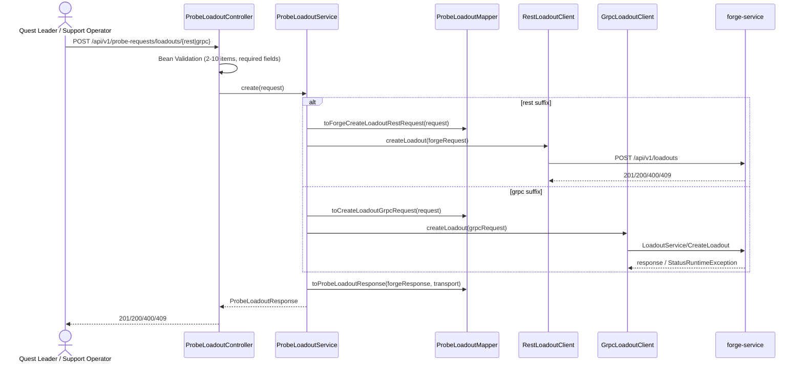

# Implementation Plan: Quest Loadout Fulfilment (probe-service)

**Branch**: `quest-loadouts` | **Date**: 2026-08-03 | **Spec**: [spec.md](./spec.md)

**Input**: Feature specification from `/specs/002-probe-quest-loadouts/spec.md`

**Parallel SDD**: Gate 1 (Parallel Design Discovery) run — see
[parallel-design-review.md](./parallel-design-review.md) (`dependency`,
PD-001). `forge-service` PR
[#4](https://github.com/Jenish16/forge-service/pull/4) owns the Loadout
aggregate and its REST/gRPC contract for this same initiative
(`POC-QUEST-LOADOUTS`); this plan defines `probe-service`'s consuming role
only, as resolved in PD-001.

## Summary

`probe-service` adds a new public Loadout REST API
(`/api/v1/probe-requests/loadouts/*`) that lets a quest leader create,
retrieve, cancel, and retry a multi-item loadout, and lets a support
operator inspect an item's attempt history — mirroring the shape of the
existing single-artifact API exactly, with a `/rest` or `/grpc` path suffix
per operation to choose the downstream transport. `probe-service` owns no
Loadout state of its own: every operation is a stateless, structurally
pre-validated pass-through to `forge-service`'s already-fixed
`/api/v1/loadouts/*` REST contract and `LoadoutService` gRPC contract
(PD-001). This requires four new client classes (REST + gRPC, mirroring
`RestForgeJobClient`/`GrpcForgeJobClient`), a mirrored copy of
`forge-service`'s new `quest_loadout_service.proto`, new `Probe*`/`Forge*`
DTOs, a new controller, service, and mapper — no new persistence,
configuration surface, or resilience instances beyond what already exists
for the single-artifact flow.

## Technical Context

**Language/Version**: Java 25 (existing toolchain, `build.gradle.kts`)

**Primary Dependencies**: Spring Boot 4 (`spring-boot-starter-webmvc`,
`-restclient`, `-validation`, `-json`), gRPC 1.69 (`grpc-netty-shaded`,
`grpc-protobuf`, `grpc-stub`), Resilience4j 2.4 (`resilience4j-spring-boot4`)
— all existing dependencies, no additions required.

**Storage**: N/A — `probe-service` persists nothing for this feature
(PD-001; consistent with `docs/entities-enums.md`, "probe-service holds no
persisted domain entities").

**Testing**: JUnit 5 + Spring Boot Test (`spring-boot-starter-webmvc-test`,
`-restclient-test`), Mockito — existing stack, mirroring
`ProbeRequestControllerTest`/`ProbeRequestServiceTest`/
`RestForgeJobClientTest`/`GrpcForgeJobClientTest`/`ProbeRequestMapperTest`.

**Target Platform**: Linux server (Spring Boot service), same as today.

**Project Type**: Single Java Spring Boot service (`web-service`) — no
frontend/mobile component.

**Performance Goals**: No new performance goals beyond the existing
single-artifact flow's implicit expectations; this is a lightweight POC
(`AGENTS.md`). Loadout calls reuse the existing `FORGE_REST`/`FORGE_GRPC`
Resilience4j circuit-breaker/retry instances and their current thresholds
(research.md D4) — no new SLOs are introduced.

**Constraints**: Must not modify the existing `/api/v1/probe-requests/
forge-jobs/{rest,grpc}` contract or behavior (FR-019). Must not duplicate
`forge-service`'s business validation rules (`AGENTS.md`). Must not
introduce a Loadout aggregate, database, or cache in `probe-service`
(PD-001).

**Scale/Scope**: 4 new public REST resources × 2 transport variants = 10
new endpoints (`POST create`, `GET retrieve`, `POST cancel`, `POST retry`,
`GET attempt-history`), all stateless pass-throughs. No new domain entities.

## Constitution Check

*GATE: Must pass before Phase 0 research. Re-check after Phase 1 design.*

`.specify/memory/constitution.md` is the unratified template (no principles
filled in) — there is no ratified project constitution to gate against.
`AGENTS.md` and `.cursor/rules/project.mdc` function as this repository's
effective constitution for a lightweight POC and are used as the gate
instead:

| Rule (`AGENTS.md` / `project.mdc`) | Compliance |
|---|---|
| "Do not add frameworks or infrastructure without a clear reason" | PASS — no new dependencies; reuses Spring Boot, gRPC, Resilience4j already in `build.gradle.kts`. |
| "Do not structure the whole service around one downstream dependency" | PASS — this feature adds one more `forge-service`-backed capability alongside the existing single-artifact one; it does not restructure the service. |
| "Do not duplicate forge-service business logic or validation rules beyond caller-side pre-checks" | PASS — research.md D7: only structural Bean Validation (item count, blank/null/range checks) is added; all business-rule validation stays in `forge-service`. |
| "Preserve REST and gRPC contracts documented in specs and proto/" | PASS — existing `/api/v1/probe-requests/forge-jobs/*` contract is untouched (FR-019); the new Loadout contract is additive. |
| "Keep public probe-service DTOs separate from downstream forge REST DTOs" | PASS — research.md D6: new `dto/request`/`dto/response` `Probe*` types are distinct from new `dto/client/forge/*` `Forge*` types. |
| "Do not create a top-level `forge` module or `com.codeistari.probe.forge` package" | PASS — new classes are added to the existing `controller`/`service`/`client`/`mapper`/`dto`/`domain` packages, no new top-level package. |

No violations — Complexity Tracking is not needed.

## Architecture



`probe-service` adds, per the existing single-artifact layering
(`docs/architecture.md`):

- `controller/ProbeLoadoutController` — 10 endpoints (5 operations × 2
  transport suffixes), Bean-Validated request DTOs, delegates to the service
  layer, returns DTOs directly (no manual status-code branching beyond
  `@ResponseStatus` on create).
- `service/ProbeLoadoutService` — one method per operation, transport
  selection via which client it calls (mirrors `ProbeRequestService`'s
  `...ViaRest`/`...ViaGrpc` pairing).
- `client/rest/RestLoadoutClient` (extends `BaseApiClient`, implements a new
  `LoadoutClient` interface mirroring `ForgeJobClient`) and
  `client/grpc/GrpcLoadoutClient` — call `forge-service`'s
  `/api/v1/loadouts/*` REST and `LoadoutService` gRPC endpoints respectively,
  annotated `@CircuitBreaker(name = "FORGE_REST"/"FORGE_GRPC")` /
  `@Retry(...)` exactly like today (research.md D4).
- `mapper/ProbeLoadoutMapper` — maps `Probe*` ⇄ `Forge*` REST DTOs and
  `Probe*` ⇄ generated gRPC message types, mirroring `ProbeRequestMapper`.
- `dto/request`, `dto/response` — new `Probe*`-prefixed public DTOs
  (data-model.md).
- `dto/client/forge/request`, `dto/client/forge/response` — new `Forge*`
  downstream REST DTOs (data-model.md).
- `proto/quest_loadout_service.proto` — mirrored copy of `forge-service`'s
  proto (research.md D5), generating the `LoadoutServiceGrpc` client stub via
  the existing Gradle `com.google.protobuf` plugin.
- No changes to `config/ForgeClientProperties`, `config/ResilienceConfig`,
  `config/RestClientFactory`, `config/GrpcForgeClientConfig`, or
  `application.yml` — the new clients reuse the existing `forge.rest.*`/
  `forge.grpc.*` connection settings and `FORGE_REST`/`FORGE_GRPC` resilience
  instances (research.md D4), since they call the same `forge-service` host.
- No changes to `exception/GlobalExceptionHandler`,
  `exception/ForgeRemoteCallException`, or `client/BaseApiClient` — the
  existing generic status-forwarding pipeline already covers every error
  case in `contracts/quest-loadouts-probe-rest.md` (research.md D9).

## Data & State Model

See [data-model.md](./data-model.md). Summary: no entities, no state
machine, no persistence — every DTO is a transient, per-request projection
of `forge-service`'s response (PD-001, research.md D1/D8).

## Interfaces & Contracts

See [contracts/quest-loadouts-probe-rest.md](./contracts/quest-loadouts-probe-rest.md)
for the full public REST contract (10 endpoints) and
[quickstart.md](./quickstart.md) for an end-to-end manual walkthrough.
`probe-service` exposes no new gRPC *server* surface (it never has, per
`docs/architecture.md`) — gRPC is used only as a downstream client transport
choice, matching the existing single-artifact flow.

## Failure Handling

- **Downstream validation/conflict failures** (`400`/`404`/`409` from
  `forge-service`): forwarded verbatim via the existing
  `BaseApiClient.handleResponse` → `ForgeRemoteCallException` →
  `GlobalExceptionHandler` pipeline (research.md D9) — no new code path.
- **Downstream network/timeout/5xx failures**: same existing
  `handleNetworkException`/circuit-breaker/retry behavior as the
  single-artifact flow (`FORGE_REST`/`FORGE_GRPC` instances, research.md
  D4) — only server/network failures count toward retry and circuit-breaker
  thresholds; 4xx-style client errors (validation, conflict) fail fast and
  are not retried, per the existing `ResilienceConfig.isRetryableFailure`
  predicate.
- **Circuit breaker open**: existing `CallNotPermittedException` handler
  returns `503 Service Unavailable`, unchanged.
- **Structural validation failures at `probe-service`** (item count,
  blank/null/range checks): `400 Bad Request` via the existing
  `MethodArgumentNotValidException` handler, unchanged.
- **No new failure modes**: because `probe-service` holds no state, there is
  no possibility of a partial-write, orphaned-record, or reconciliation
  failure on the `probe-service` side — every request either fully forwards
  or fully fails before any downstream call is made (Bean Validation runs
  first).

## Compatibility

- The existing `/api/v1/probe-requests/forge-jobs/{rest,grpc}` endpoints,
  `ProbeForgeJobResponse` shape, and `ForgeJobClient` interface are
  unmodified (FR-019, verified in quickstart.md step 8).
- The new Loadout resource is fully additive — no existing DTO, client
  interface, controller route, or configuration key is changed or removed.
- `domain.ArtifactType` and `domain.ForgeMaterial` are reused as-is for
  Loadout items (no new enum needed); `domain.ForgeTransport` is reused
  unchanged to tag `ProbeLoadoutResponse.transport`.

## Security

- No new authentication/authorization surface — this POC has none today
  (consistent with existing single-artifact endpoints) and this feature does
  not change that posture.
- Per org-wide secure coding rules: all new request DTOs use Jakarta Bean
  Validation to reject malformed/oversized input before it reaches any
  downstream call or is logged (§1.1/§1.4); no raw user input is
  concatenated into URIs — `RestClient` URI templates with variable binding
  are used throughout, matching `BaseApiClient`'s existing pattern (§1.2);
  no secrets are introduced; error responses continue to return only the
  message `forge-service` provided or a generic fallback, never a stack
  trace (`ErrorResponse`, existing pattern, §11.1/§11.2).
- `forge-service`'s response fields are treated as untrusted-but-well-formed
  JSON/protobuf from a known internal service and deserialized via the
  existing typed `ObjectMapper`/protobuf-generated classes — no dynamic
  deserialization is introduced (§4.3).

## Observability

- Reuses the existing `BaseApiClient` request/response `INFO`-level logging
  (`"Calling {} → {} {}"` / `"{} ← status {}"`) for the new
  `RestLoadoutClient` — no new logging framework or fields.
- No new metrics/tracing infrastructure is added, consistent with
  `.cursor/rules/docs-maintenance.mdc` ("Do not add New Relic/metrics docs
  or heavy Mermaid diagrams beyond the required component/sequence
  diagrams — this stays a lightweight POC").

## Testing Strategy

Mirrors the existing test suite's structure and tooling 1:1 (no new test
framework):

| Layer | New test class | Mirrors |
|---|---|---|
| Controller | `ProbeLoadoutControllerTest` (`@WebMvcTest`) | `ProbeRequestControllerTest` |
| Service | `ProbeLoadoutServiceTest` (Mockito) | `ProbeRequestServiceTest` |
| REST client | `RestLoadoutClientTest` (`RestClient.Builder` + `MockRestServiceServer` or WireMock, matching existing setup) | `RestForgeJobClientTest` |
| gRPC client | `GrpcLoadoutClientTest` (in-process gRPC server) | `GrpcForgeJobClientTest` |
| Mapper | `ProbeLoadoutMapperTest` | `ProbeRequestMapperTest` |

Coverage maps directly to the spec's acceptance scenarios and edge cases:
2–10 item boundary (FR-001), mixed valid/invalid items (FR-002/FR-003),
zero-valid-items rejection (FR-004), item order preservation (FR-005),
`ACCEPTED`-always create status (FR-006), idempotent resubmission (FR-008)
and conflicting resubmission (FR-009), status derivation precedence
(FR-011), attempt history retrieval (FR-012), cancellation no-op (FR-014)
and terminal-cancelled-item behavior (FR-015), full-set retry (FR-016),
retained attempt history after retry (FR-017), no-duplicate-retry (FR-018),
and unchanged single-artifact behavior (FR-019). Downstream `forge-service`
responses are stubbed/mocked in every layer above `RestLoadoutClient`/
`GrpcLoadoutClient` — no live `forge-service` dependency in the test suite,
matching the existing pattern.

## Rollout

Single-service, additive-only change with no data migration and no
configuration change (research.md D4 reuses existing `FORGE_REST`/
`FORGE_GRPC` instances and `forge.rest.*`/`forge.grpc.*` properties).
Deployable independently of `forge-service`'s own rollout as long as
`forge-service`'s `/api/v1/loadouts/*` and `LoadoutService` gRPC endpoints
are live in the target environment before `probe-service`'s Loadout
endpoints are exercised — otherwise calls fail fast via the existing
`ForgeRemoteCallException`/circuit-breaker handling with no risk to the
unaffected single-artifact flow.

## Rollback

Because the feature is purely additive and stateless, rollback is a plain
revert/redeploy of `probe-service` to the prior build — there is no data to
migrate back, no schema to reverse, and no effect on the existing
single-artifact endpoints either way.

## Risks, Trade-offs & Alternatives

| Risk/Trade-off | Assessment |
|---|---|
| `forge-service`'s Loadout contract (PR #4) is still in `tech-design-in-progress` and unmerged; its shape could still change before implementation. | Accepted risk for a POC — `probe-service`'s implementation cannot start ahead of `forge-service`'s merged contract in practice; this plan documents the contract as currently published so both sides can implement in parallel once `forge-service`'s PR merges. Re-run Gate 2 (Implementation Conflict Check) before implementation per `AGENTS.md`. |
| Reusing `FORGE_REST`/`FORGE_GRPC` resilience instances means a `forge-service` outage affecting single-artifact calls also throttles Loadout calls, and vice versa (research.md D4). | Accepted trade-off — both call the same downstream host; isolating them would add configuration surface with no functional requirement demanding it in this POC. |
| Duplicating `forge-service`'s enum value sets (`ArtifactType`, `ForgeMaterial`, and now opaque status strings) risks drift if `forge-service` changes them. | Same accepted risk as the existing single-artifact flow (`docs/entities-enums.md`); status values are kept opaque specifically to minimize this risk for the new Loadout/item/approval status fields (research.md D3). |
| Alternative considered: `probe-service` builds its own Loadout aggregate/state instead of a pure pass-through. | Rejected (PD-001) — would conflict with `forge-service`'s already-fixed ownership of the Loadout aggregate for this initiative. |
| Alternative considered: single fixed-transport endpoints instead of `/rest`/`/grpc` suffixes. | Rejected (research.md D2, developer-confirmed) — breaks FR-020's parity with the existing transport-choice pattern. |

## Validation Approach

1. Automated tests per the Testing Strategy table above, run via the
   existing `./gradlew test` task.
2. Manual walkthrough of [quickstart.md](./quickstart.md) against a locally
   running `forge-service` (once its Loadout endpoints are implemented) to
   confirm the eight scenarios (create, idempotent replay, conflicting
   replay, retrieve, attempt history, retry, cancel, single-artifact
   regression check).
3. Re-run `speckit.parallel-sdd.implementation-check` (Gate 2) before
   implementation begins, per `AGENTS.md`, since `forge-service`'s
   counterpart PR is still in progress.

## Project Structure

### Documentation (this feature)

```text
specs/002-probe-quest-loadouts/
├── plan.md                          # This file
├── research.md                      # Phase 0 output
├── data-model.md                    # Phase 1 output
├── quickstart.md                    # Phase 1 output
├── contracts/
│   └── quest-loadouts-probe-rest.md # Phase 1 output
├── parallel-design-review.md        # Gate 1 output
├── status.yaml
├── spec.md
└── checklists/requirements.md
```

### Source Code (repository root)

```text
src/main/java/com/codeistari/probe/
├── controller/
│   └── ProbeLoadoutController.java          # NEW — 10 endpoints
├── service/
│   └── ProbeLoadoutService.java             # NEW
├── client/
│   ├── LoadoutClient.java                   # NEW — interface, mirrors ForgeJobClient
│   ├── rest/RestLoadoutClient.java          # NEW
│   └── grpc/GrpcLoadoutClient.java          # NEW
├── mapper/
│   └── ProbeLoadoutMapper.java              # NEW
├── dto/
│   ├── request/
│   │   ├── CreateProbeLoadoutRequest.java       # NEW
│   │   ├── ProbeLoadoutItemRequest.java         # NEW
│   │   ├── RetryProbeLoadoutRequest.java        # NEW
│   │   └── RetryProbeLoadoutItemRequest.java    # NEW
│   ├── response/
│   │   ├── ProbeLoadoutResponse.java            # NEW
│   │   ├── ProbeLoadoutItemResponse.java        # NEW
│   │   ├── ProbeRejectedLoadoutItemResponse.java # NEW
│   │   ├── ProbeLoadoutAttemptHistoryResponse.java # NEW
│   │   └── ProbeLoadoutAttemptResponse.java     # NEW
│   └── client/forge/
│       ├── request/  (Forge*LoadoutRestRequest classes)  # NEW
│       └── response/ (Forge*LoadoutRestResponse classes) # NEW
└── (no changes to config/, exception/, domain/, ProbeServiceApplication.java)

proto/
└── quest_loadout_service.proto      # NEW — mirrored from forge-service#4

src/test/java/com/codeistari/probe/
├── controller/ProbeLoadoutControllerTest.java  # NEW
├── service/ProbeLoadoutServiceTest.java        # NEW
├── client/rest/RestLoadoutClientTest.java      # NEW
├── client/grpc/GrpcLoadoutClientTest.java      # NEW
└── mapper/ProbeLoadoutMapperTest.java          # NEW
```

**Structure Decision**: Single Java Spring Boot service (existing
`probe-service` project layout, `AGENTS.md` package structure:
`controller`, `dto`, `service`, `client`, `mapper`, `config`, `exception`,
`domain`). No new top-level module or package — every new class is added to
an existing package (PD-001; mirrors the existing single-artifact flow's
structure exactly).

## Complexity Tracking

No Constitution Check violations — this section is not needed.
